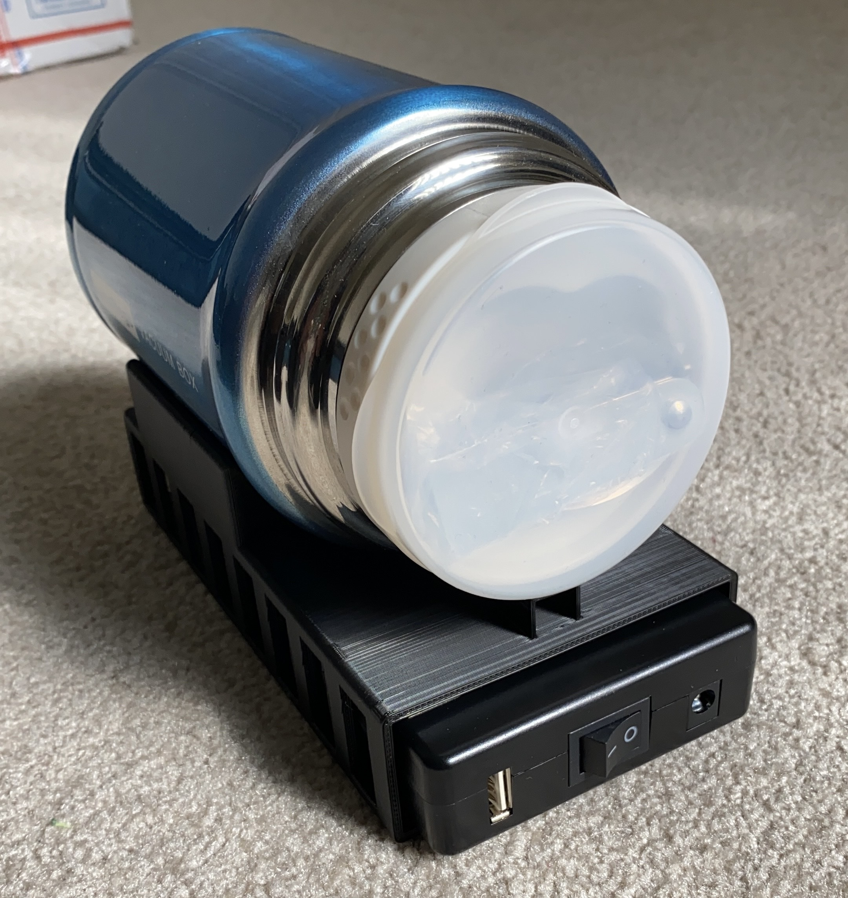
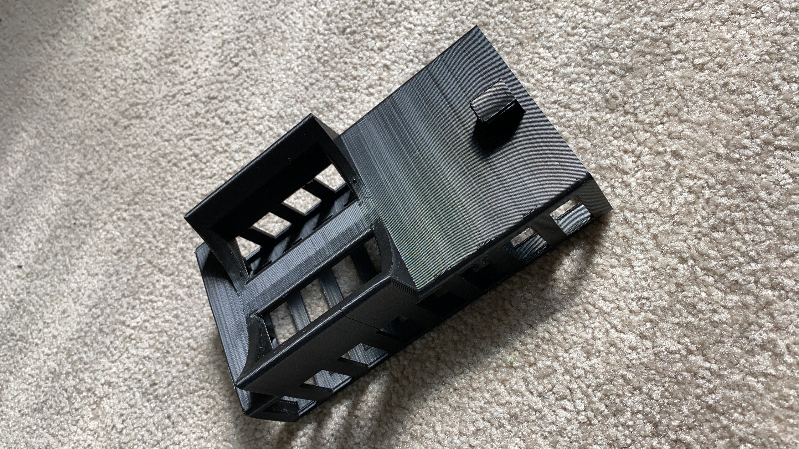

# Moonrat II

Moonrat: A second-generation portable incubator.
This is the development effort of 2023.

# Current Status

This project is currently seeking a new lead engineer skilled in Arduino programming and relatively
simple microelectronics design. We have a working prototype that was made by hand. It is likely time
to make a simple PCB design. We have functional software, but it is messy; a rewrite is needed.
I believe a skilled maker could finish the project to the level of short-run mass production in a
quarter of working 6-10 hours per week. We have a skilled 3D modeller available already. Significant
supervision will be provided by Robert L. Read, founder of Public Invention.

# Future Work

We need to make a design suitable for testing and short-run production of 20 units.

## Motivation

By building a small, portable, intelligent incubator that can maintain constant elevated temperature, a variety of biological experiments and assays can be
performed "in the field" without having access to a electric grid power.

## Origin

This is an offshoot of the [Rapid E. coli project](https://github.com/PubInv/rapid-e-coli). It is an attempt to build a better, smaller, more intelligent
portable incubator that the Armadillo, described [elsewhere](http://jhe.ewb.org.au/index.php/jhe/article/view/127) and buildable from an [instructable](https://www.instructables.com/id/Portable-Petrifilm-Incubator-for-Inexpensive-In-Fi/).

## Current Design

Our current design uses a soup thermos to have good insulation. 3D printed parts hold the Petrifilms inside the thermos and way from the metal edges.
Additional parts hold the heating cloth and thermometer, which our powered and sensed by an external Arduino.

<a
href="https://user-images.githubusercontent.com/5296671/130527922-66cce437-a89f-4815-a980-bc79295f1a5a.JPG">
IMG-2511
</a> 

Our previous design use a "casette" which is bolted to the inside of the lid of a thermos bottle, shown below. Our circuit is on a breadboard, and we have not yet designed the enclosure for the electronics integrated into the cap or as a holder for the bottle. We use a 3D printed bracket to hold the Thernos bottle. We believe this is the most compact design which will be thermally efficient.

## Fundamental Modularity: The 6-wire appliance

The electronic elements of this incubator can be separated into two modules.
As usual, identifying this modularity allows improvements in our ability to evolve the design.
The heat-insulation thermos is a third module.

Call the part that goes into the thermos the "appliance" and the parts that are outside it the "controller".
The appliance consists of a heating element and a thermometer, the wires and a connector.
The controller consists of a microcontroller, an electronic power circuit, and some means of programming the
controller, all packed into an enclosure.

The "appliance" needs only 6 wires:
1. GND (ground, nominally voltage 0.)
2. +12V PWR (the heating elements requires approximately 12V power.)
3. HEAT ON (Vin)
4. +5V (for the thermometer).
5. SIG -- data from the digial "one-wire" format
6. UNK - a final wire is included for future functionality that is unknown right now.

These (esp. the power) should probably be rated for 2 amps, but in practice 1 amp is probably good enough.

We have not yet chosen the connector, but we would like the connector to be of minimal width, so,
for example, a 3x2 JST layout would be better than 6 pins in line.

### Previous designThermos Bottle in Bracekt With Battery in Place
<a
href="./moonrat/3D_printed_part_pictures/6C0C779D-602B-4875-BB12-1951AA8B21C5.jpg">
Thermos Bottle In Bracket With Battery
</a> 

### Bracket by Itself
<a
href="./moonrat/3D_printed_part_pictures/9DBF69BE-EAB6-436A-977B-694C6931730C.jpg">
Bracket by itself
</a> 

Our analysis is preliminary, but our current tests show we at 25C ambient temperature we can hold the needed 35C incubation temperature with only
(12V * 12V / 8 Ohms * 6% duty cycle * 48 hours) = 51.84 Watt Hours.  This will have to be supplied by a battery pack, which will be about the same size as the Thermos bottle.

<a
href="https://user-images.githubusercontent.com/5296671/110479740-580de280-80ab-11eb-90c4-a859c0519b3d.png">
MoonratWithBreadBoard
</a> 

## Initial Design Approach

<a
href="https://user-images.githubusercontent.com/5296671/86680945-b470ad80-bfc4-11ea-9ef6-19c4f70aceba.png">
Basic Structure of Portable Incubator (1)
</a> 

## References (Incomplete)

1. Petrifilms: [https://www.3m.com/3M/en_US/company-us/all-3m-products/~/ECOLICT-3M-Petrifilm-E-coli-Coliform-Count-Plates/?N=5002385+3293785155&rt=rud](https://www.3m.com/3M/en_US/company-us/all-3m-products/~/ECOLICT-3M-Petrifilm-E-coli-Coliform-Count-Plates/?N=5002385+3293785155&rt=rud)
1. EPA Guidelines: [https://19january2017snapshot.epa.gov/sites/production/files/2015-11/documents/drinking_water_sample_collection.pdf](https://19january2017snapshot.epa.gov/sites/production/files/2015-11/documents/drinking_water_sample_collection.pdf)
1. Original Incubator Paper - [http://jhe.ewb.org.au/index.php/jhe/article/view/127](http://jhe.ewb.org.au/index.php/jhe/article/view/127)
1. Construction of a Low-cost Mobile Incubator for Field and Laboratory Use [https://www.jove.com/t/58443/construction-low-cost-mobile-incubator-for-field-laboratory](https://www.jove.com/t/58443/construction-low-cost-mobile-incubator-for-field-laboratory)
1. Solar Powered Portable Culture
Incubator [https://www.jscimedcentral.com/Pediatrics/pediatrics-3-1063.pdf](https://www.jscimedcentral.com/Pediatrics/pediatrics-3-1063.pdf)

## Acknowledgements

Thanks to Dr. Sabia Abidi of Rice University for input and references.
