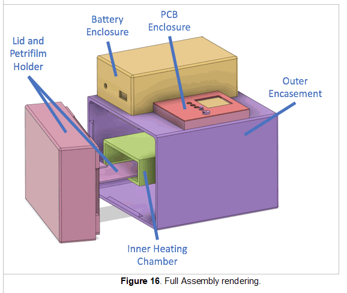

# RiceMiniCubator  
This folder contains the Moonrat development effort artifacts of Rice University students of 2020.

The RiceMiniCubator  

## Project Summary
Implimented with an Arduino NANO this effort included design of a 3D printed incubation chamber. 
The chamber was insulated with polyurathan expanding foam.

### Electronic Details
The electronics include
* Arduino Nano, Embedded controller assembly
* OLED display, 128x128., User output
* Three buttons, User input
* Piezo Buzzer, User alert
* Termistor, for temprature measurement
* IRLB8721 MOSFET, to switch heater current
* Battery, ???

See: [CircuitHardware_MinicubatorTeam_Cycle5.pdf](CircuitHardware_MinicubatorTeam_Cycle5.pdf) for schematic and PCB screen shots
See: [AssemblyInstructions_MinicubatorTeam_Cycle5.docx](AssemblyInstructions_MinicubatorTeam_Cycle5.docx)

### Project Firmware
See the files in forlder: Code_MinicubatorTeam_Cycle5

### Enclosure Details
See the files in the folder: CAD_MinicubatorTeam_Cycle5

<h6><i> This file created by F. Lee Erickson, 20230518</i></h6>
