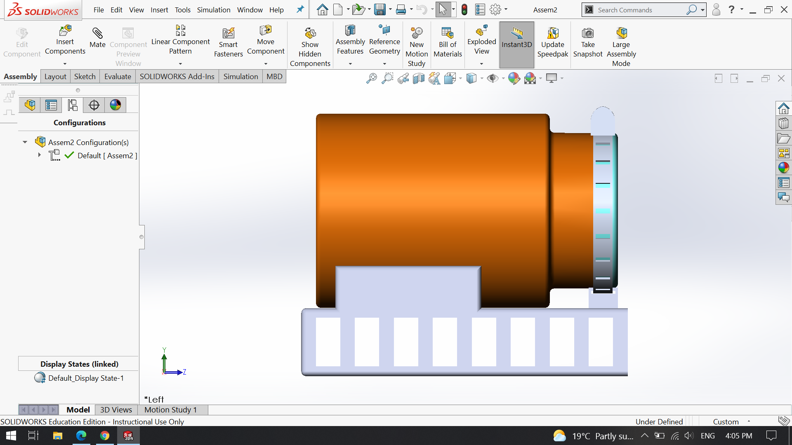
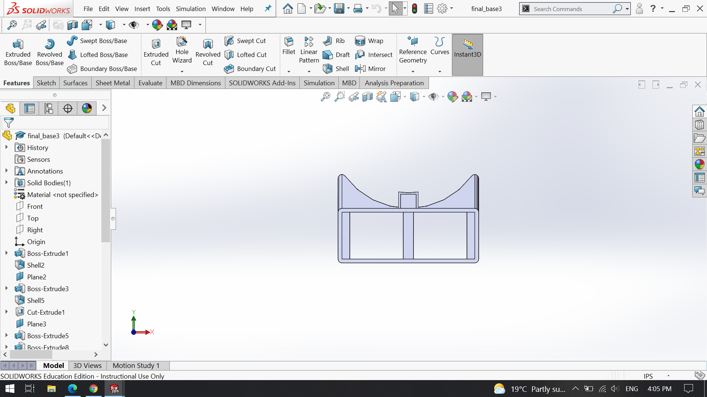
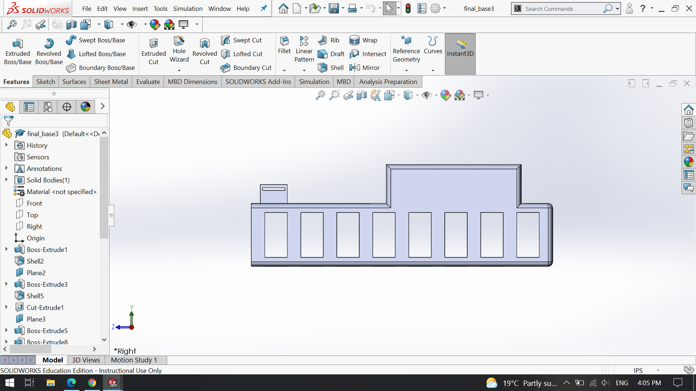

# 3D_design
This folder contains artifacts of the design of base to hold a thermos used to incubate samples.

 

 
 

 

 

[And an animation of the assembly](assembly_animation.mp4)

<h6><i> This file created by F. Lee Erickson, 20230518</i></h6>