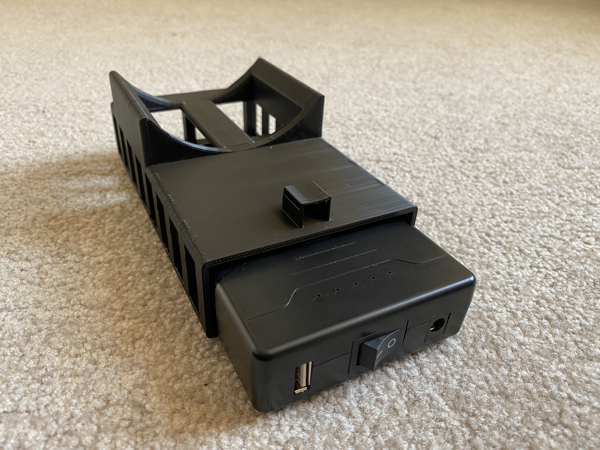

# 3D_design
This folder contains photographs of the fabricated 3D base to hold a thermos used to incubate samples.  
The Solidworks desing files are in the folder: 3D_design

 

 
 

 

 

 

 

 

 

<h6><i> This file created by F. Lee Erickson, 20230518</i></h6>