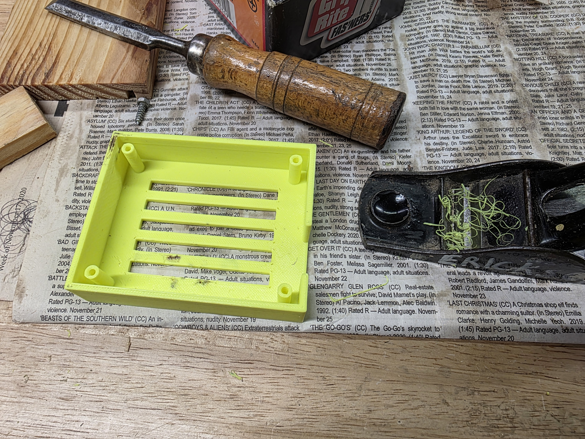
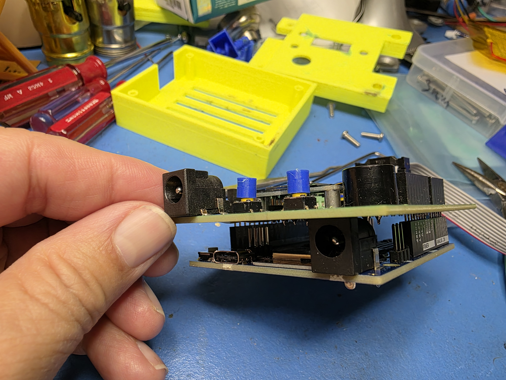
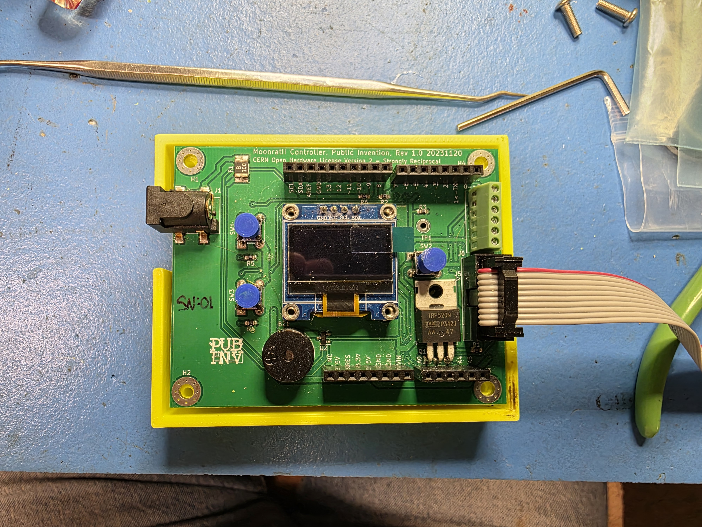
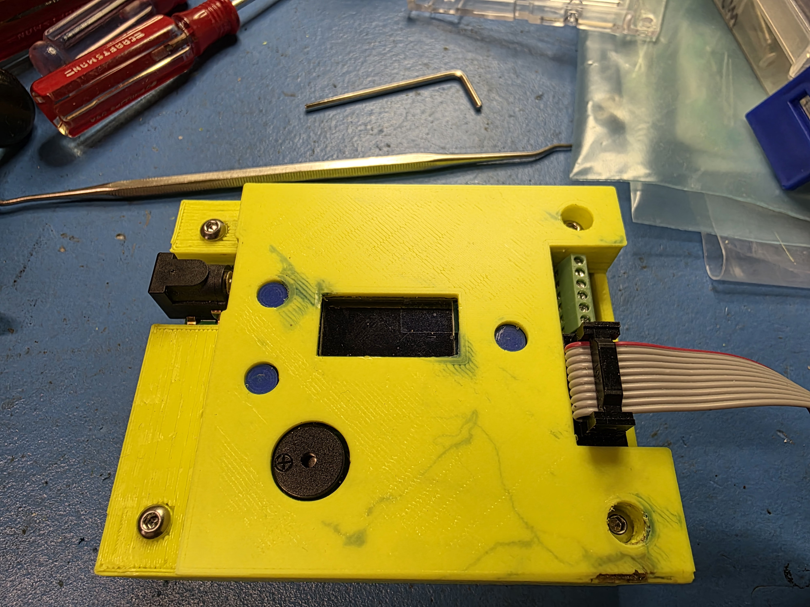
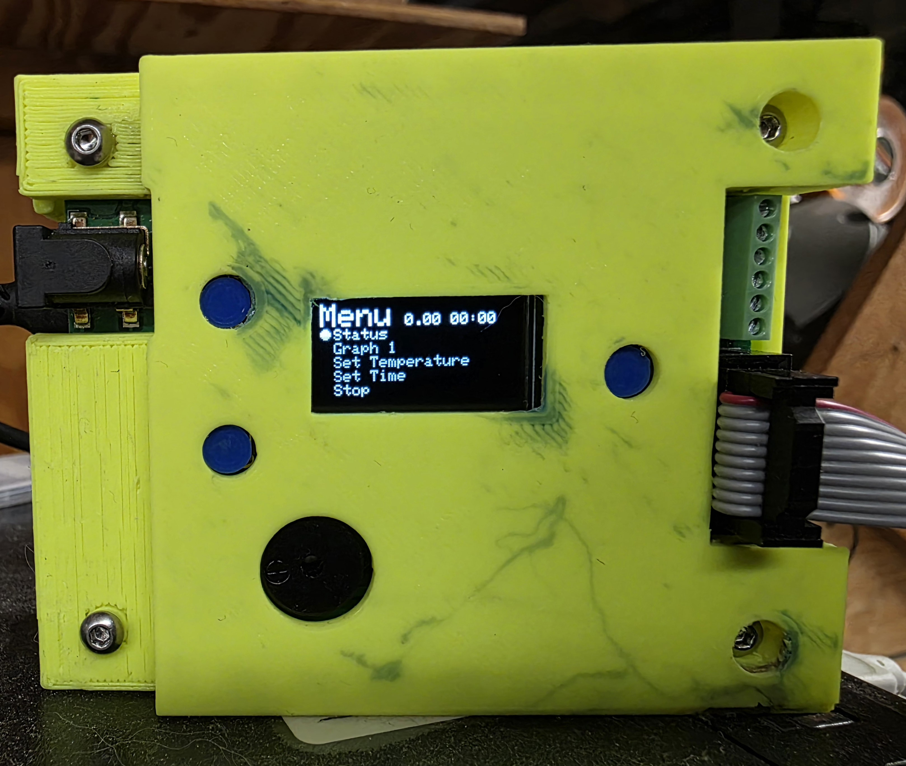

# Assembly of An Enclosure for the MoonratII Controller

Designed in Free CAD V0.19 - 1.0
Designed by Sylvia, Melanie Laporte, (Forrest) Lee Erickson

## Image Gallery - Current FreeCAD Assembly Designs
|A    |B    |C    |
| --- | --- | --- |
|   Base rough print.|   Base clean up with chisel| NA|
|  Cover clean up.|   Cover on base. No PWAs.| NA|
|  MoonRatII PWA onto R4.|   Base with PWAs.| NA|
|  MoonRateII assembled.|   MoonRatII with Menu Display.|   NA|